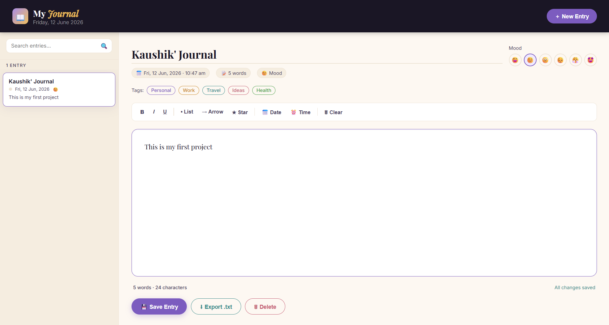

## My Personal Journal

A personal journaling web application that allows users to create, organize, and manage daily journal entries with mood tracking and tagging features.

## Features

- Rich text editor — Bold, Italic, Underline formatting
- Auto-save — saves as you type, persists across sessions
- Mood tracker — log your mood with every entry
- Color-coded tags — Personal, Work, Travel, Ideas, Health
- Live search across all entries
- Export entries as .txt files
- Word & character count in real time
  
## Tech Stack

- HTML5
- CSS3
- JavaScript
- Local Storage

## 📸 Preview



## How to Run

1. Clone the repository
   ```bash
   git clone https://github.com/Kaushik-Surapalli/Personal-Journal-App
   ```

2. Open `index.html` in your browser.

##  Key Learnings

- DOM Manipulation
- Event Handling
- Local Storage CRUD Operations
- Search and Filtering
- Dynamic UI Design

## 👨‍💻 Author
**Kaushik Surapalli**

GitHub: https://github.com/Kaushik-Surapalli
Email: kaushiksurapalli@gmail.com
